# MVP de Engenharia de Dados — Acidentes em Rodovias Federais (PRF)

## Visão Geral

Este projeto foi desenvolvido como MVP da pós-graduação em Ciência de Dados e Analytics, na sprint de Engenharia de Dados.

O trabalho utiliza dados abertos da Polícia Rodoviária Federal (PRF) referentes a acidentes ocorridos em rodovias federais brasileiras entre 2021 e 2025. O objetivo é construir um pipeline de dados em nuvem, desde a ingestão dos arquivos brutos até a criação de uma camada analítica modelada para responder a perguntas de negócio.

A solução foi implementada no **Databricks Free Edition**, utilizando **Python**, **PySpark**, **Apache Spark**, **Delta Lake** e **Unity Catalog**.

O pipeline segue a arquitetura em camadas:

- **Bronze:** dados brutos consolidados e preservados;
- **Silver:** dados tratados, tipados, padronizados e enriquecidos;
- **Gold:** dados modelados dimensionalmente para consumo analítico.

---

# 1. Problema, Objetivo e Perguntas de Negócio

## 1.1 Problema

> **Quero entender quais fatores temporais, geográficos, ambientais e rodoviários estão mais associados à ocorrência e à gravidade dos acidentes em rodovias federais brasileiras entre 2021 e 2025.**

A definição do problema foi realizada antes da construção do pipeline, de forma que as perguntas de negócio orientassem a escolha da fonte, os campos utilizados, as transformações necessárias e a modelagem dos dados.

## 1.2 Objetivo Geral

Construir um pipeline de Engenharia de Dados utilizando dados abertos da Polícia Rodoviária Federal, aplicando etapas de ingestão, tratamento, validação de qualidade, modelagem e análise dos acidentes ocorridos nas rodovias federais brasileiras entre 2021 e 2025.

Ao final do processo, os dados devem estar estruturados de forma a permitir a análise das principais características associadas à ocorrência e à gravidade dos acidentes.

## 1.3 Perguntas de Negócio

1. **Como o número de acidentes, feridos e mortos evoluiu entre 2021 e 2025?**
2. **Quais estados, municípios e rodovias concentram mais acidentes e vítimas fatais?**
3. **Como a gravidade dos acidentes varia de acordo com o dia da semana, horário e fase do dia?**
4. **Como condições meteorológicas, tipo de pista e características do traçado da via estão associadas à gravidade dos acidentes?**
5. **Quais causas e tipos de acidente apresentam maior proporção de ocorrências com vítimas fatais?**

---

# 2. Fonte e Coleta dos Dados

Os dados utilizados são provenientes do **Portal de Dados Abertos da Polícia Rodoviária Federal (PRF)**, utilizando os arquivos de acidentes **agrupados por ocorrência**.

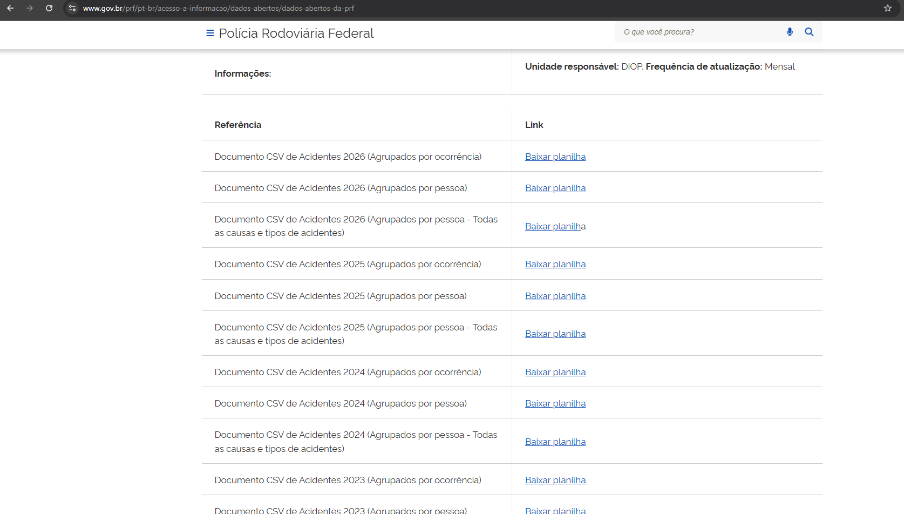

Foram selecionados os anos completos de 2021 a 2025. O ano de 2026 não foi utilizado por ainda estar em andamento, evitando comparar anos completos com um período parcial.

## 2.1 Arquivos utilizados

| Arquivo | Registros |
|---|---:|
| `datatran2021.csv` | 64.567 |
| `datatran2022.csv` | 64.606 |
| `datatran2023.csv` | 67.766 |
| `datatran2024.csv` | 73.156 |
| `datatran2025.csv` | 72.529 |
| **Total** | **342.624** |

Todos os arquivos apresentaram:

- 30 colunas originais;
- separador `;`;
- codificação Windows-1252 / CP1252;
- mesmo conjunto de colunas;
- mesma ordem de colunas.

A coleta foi realizada por download direto dos CSVs disponibilizados pela PRF. Para o escopo do MVP, foi adotado upload manual dos arquivos ao Databricks, já que a fonte disponibiliza os dados prontos para consumo e o objetivo principal do trabalho é exercitar ingestão, tratamento, modelagem e análise em ambiente de nuvem.

---

# 3. Carga e Pipeline

## 3.1 Subida dos dados para o Databricks

Os cinco arquivos CSV foram enviados manualmente para um Volume no Databricks:

```text
/Volumes/workspace/default/prf_raw
```

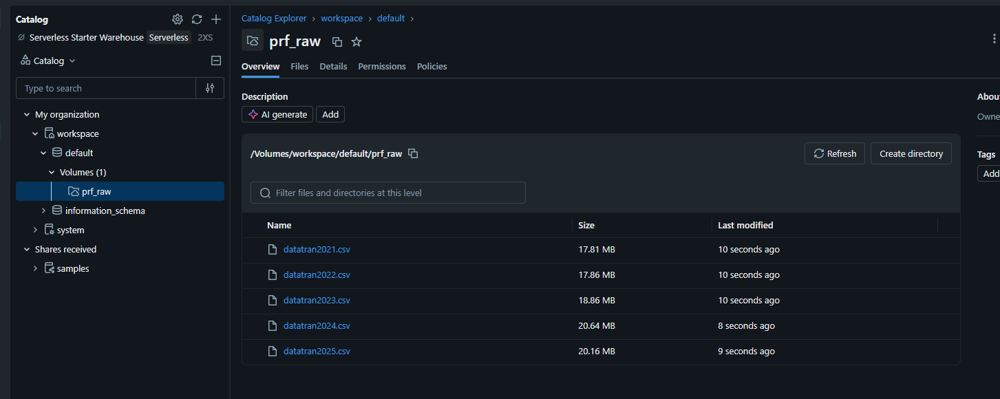

Os arquivos foram lidos com PySpark utilizando:

- cabeçalho;
- separador `;`;
- codificação `windows-1252`.

Na ingestão inicial, os campos foram mantidos como `string` para evitar inferência automática de tipos e preservar a estrutura original antes das transformações.

Antes da consolidação, foi validado que os cinco arquivos possuíam a mesma estrutura.

Os arquivos foram unidos utilizando `unionByName`.

Também foram criados dois campos de rastreabilidade:

- `ano_arquivo`;
- `arquivo_origem`.

Após a consolidação:

- **342.624 registros**;
- **32 colunas**.

A camada Bronze foi persistida em formato Delta:

```text
workspace.default.prf_acidentes_bronze
```

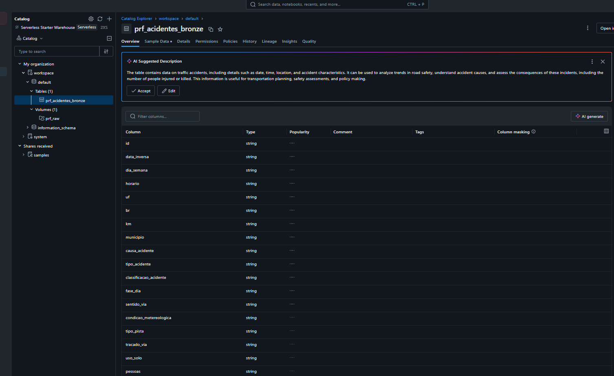

A implementação completa dessa etapa está em:

[`01_ingestao_dados_prf.ipynb`](notebooks/01_ingestao_dados_prf.ipynb)

## 3.2 Etapas do Pipeline

O pipeline foi dividido em cinco notebooks sequenciais:

| Etapa | Notebook | Responsabilidade |
|---|---|---|
| 1 | [`01_ingestao_dados_prf.ipynb`](notebooks/01_ingestao_dados_prf.ipynb) | Leitura dos CSVs, validação estrutural, consolidação e Bronze |
| 2 | [`02_profiling_qualidade_inicial.ipynb`](notebooks/02_profiling_qualidade_inicial.ipynb) | Profiling e análise de qualidade |
| 3 | [`03_transformacao_silver.ipynb`](notebooks/03_transformacao_silver.ipynb) | Tratamento, tipagem, padronização e Silver |
| 4 | [`04_modelagem_gold.ipynb`](notebooks/04_modelagem_gold.ipynb) | Modelagem dimensional e Gold |
| 5 | [`05_analise_dados.ipynb`](notebooks/05_analise_dados.ipynb) | Resposta às perguntas de negócio |

Fluxo geral:

```text
Portal de Dados Abertos da PRF
        ↓
Arquivos CSV 2021–2025
        ↓
Volume prf_raw
        ↓
Camada Bronze
        ↓
Profiling e Qualidade
        ↓
Camada Silver
        ↓
Modelagem Gold
        ↓
Análises de Negócio
```

---

# 4. Qualidade dos Dados

A análise de qualidade foi executada sobre a camada Bronze antes das transformações.

Foram avaliadas cinco dimensões principais:

- **Completude**
- **Unicidade**
- **Consistência**
- **Acurácia**
- **Outliers e potenciais inconsistências**

A análise completa está documentada em:

[`02_profiling_qualidade_inicial.ipynb`](notebooks/02_profiling_qualidade_inicial.ipynb)

## 4.1 Completude

### Verificação

A primeira verificação não identificou valores `NULL` nem strings vazias nas 32 colunas da camada Bronze.

Entretanto, uma segunda análise mostrou que alguns campos utilizavam marcadores textuais para representar ausência de informação.

### Achados

| Campo | Marcador | Quantidade |
|---|---|---:|
| `condicao_metereologica` | `IGNORADO` | 4.492 |
| `sentido_via` | `NÃO INFORMADO` | 883 |
| `uop` | `N/A` | 267 |
| `delegacia` | `N/A` | 112 |
| `regional` | `NA` | 15 |
| `delegacia` | `NA` | 15 |
| `uop` | `NA` | 15 |
| `regional` | `N/A` | 12 |
| `classificacao_acidente` | `NA` | 5 |

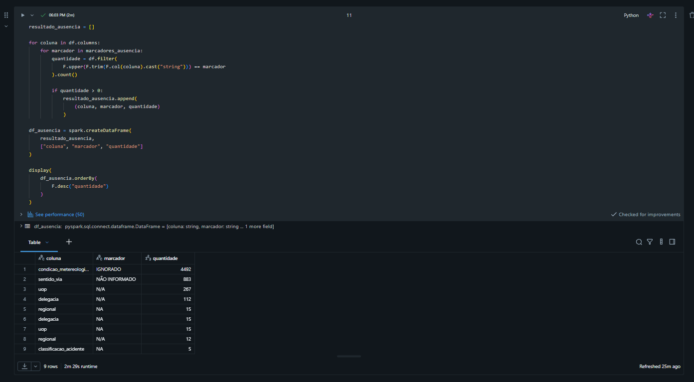

### Decisão no pipeline

Esses marcadores foram convertidos para `NULL` na camada Silver.

A decisão preserva semanticamente a ausência de informação em vez de tratar `IGNORADO`, `N/A`, `NA` ou `NÃO INFORMADO` como categorias válidas.

---

## 4.2 Unicidade

### Verificação

Como a base utilizada está agrupada por ocorrência, o campo `id` deveria identificar unicamente cada acidente.

Foram verificadas:

- duplicidades do identificador `id`;
- linhas completamente duplicadas.

### Achados

Não foram encontrados IDs duplicados nem registros completamente duplicados.

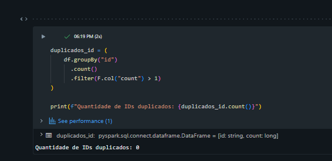

### Decisão no pipeline

Nenhuma linha precisou ser removida por duplicidade.

A granularidade de uma linha por ocorrência foi preservada nas camadas Bronze, Silver e Gold.

---

## 4.3 Consistência

### Verificação

Foram avaliadas regras de consistência entre campos e categorias, incluindo:

- compatibilidade entre o ano de `data_inversa` e `ano_arquivo`;
- formato e validade dos horários;
- ausência de valores numéricos negativos;
- compatibilidade entre `feridos`, `feridos_leves` e `feridos_graves`;
- diferenças de escrita em campos categóricos;
- comportamento temporal de categorias suspeitas;
- estrutura multivalorada de `tracado_via`.

### Achados e decisões

#### Padronização de `causa_acidente`

Foi identificada a mesma categoria com diferença apenas de capitalização:

```text
Transitar no Acostamento
Transitar no acostamento
```

As duas formas totalizavam 2.080 registros.

Na camada Silver, o valor foi padronizado como:

```text
Transitar no Acostamento
```

#### Investigação de `Colisão lateral`

Foram encontradas as categorias:

- `Colisão lateral`;
- `Colisão lateral mesmo sentido`;
- `Colisão lateral sentido oposto`.

A categoria genérica apareceu apenas em janeiro e fevereiro de 2021, totalizando 676 registros.

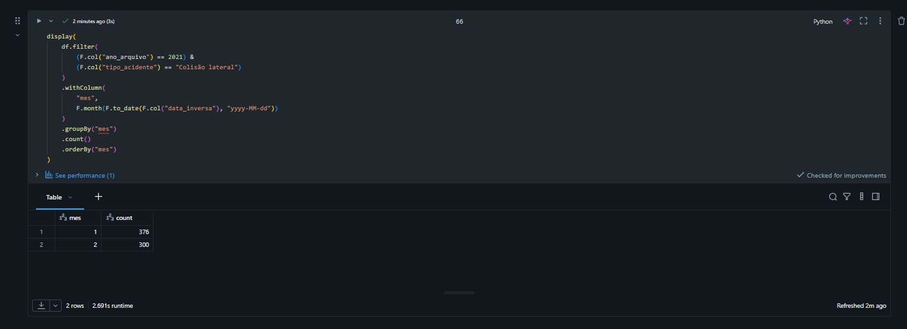

Como não havia informação suficiente para determinar se cada ocorrência deveria ser classificada como mesmo sentido ou sentido oposto, os registros foram preservados como estavam na fonte.

#### Campo multivalorado `tracado_via`

A coluna `tracado_via` apresentou 1.214 combinações distintas porque uma mesma ocorrência pode possuir múltiplas características separadas por `;`.

Foram identificados:

- **67.741 registros** com múltiplas características;
- aproximadamente **19,77% da base**;
- **12 características individuais** após separação.

Na Silver foi criada a coluna `tracado_via_lista`.

Na Gold, esse comportamento foi tratado por meio de:

- `dim_tracado`;
- `ponte_acidente_tracado`.

Essa decisão preserva a relação muitos-para-muitos sem duplicar registros na tabela fato.

---

## 4.4 Acurácia

### Verificação

Como não havia uma segunda fonte independente para validar cada ocorrência da PRF, a acurácia foi avaliada por meio de regras de domínio, validade e plausibilidade interna dos campos.

Foram verificados:

- `data_inversa`: formato e conversão para data;
- `horario`: validade do horário informado;
- `uf`: valores compatíveis com unidades federativas;
- `br`: possibilidade de conversão para valor numérico;
- `km`: possibilidade de conversão após normalização do separador decimal;
- `latitude` e `longitude`: possibilidade de conversão e limites geográficos válidos;
- campos de pessoas, mortos, feridos e veículos: possibilidade de conversão para inteiro;
- relações lógicas entre campos numéricos.

### Achados

Todos os 342.624 registros de `data_inversa` apresentaram o formato `yyyy-MM-dd`.

Não foram identificados problemas relevantes nas validações de domínio e conversão realizadas.

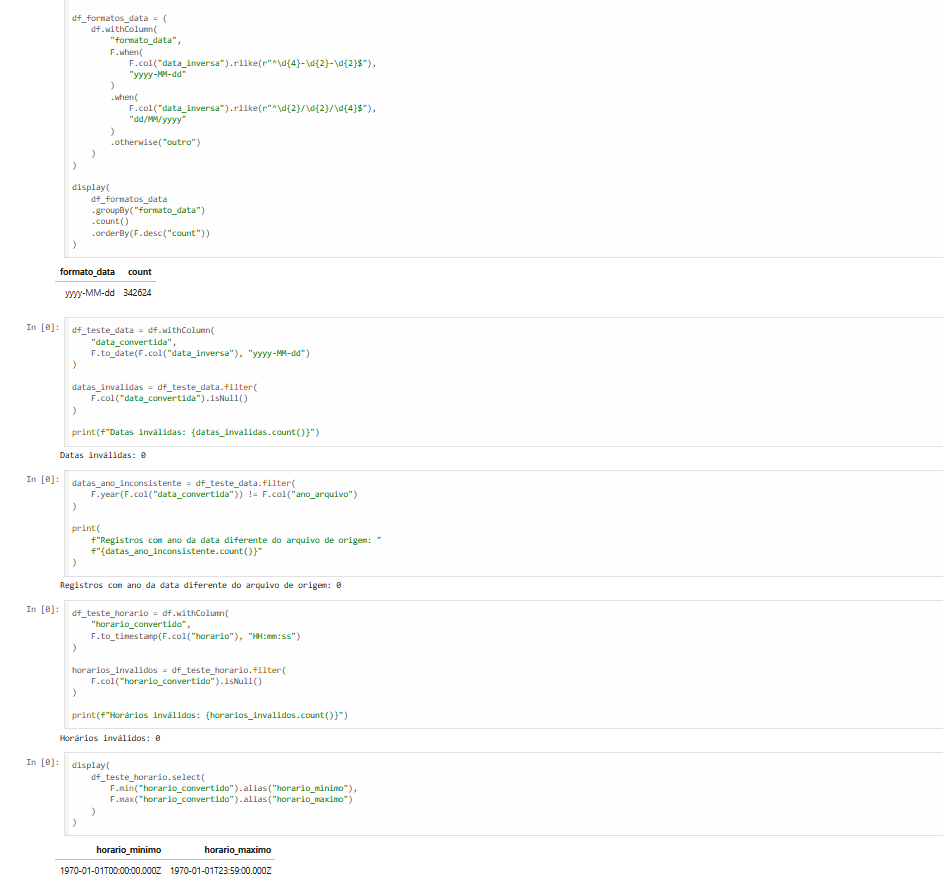

Os campos numéricos utilizados na análise puderam ser convertidos para os tipos esperados sem perda de registros.

### Decisão no pipeline

As conversões de tipo foram aplicadas na camada Silver somente após as validações.

A análise de acurácia deste trabalho deve ser entendida como **validade e plausibilidade interna**, e não como confirmação externa de que cada valor representa com exatidão o evento real.

---

## 4.5 Outliers e potenciais inconsistências

### Verificação

Foram analisados valores extremos em campos como:

- `pessoas`;
- `mortos`;
- `feridos`;
- `veiculos`.

### Achados

Entre os maiores valores observados estavam:

- até 95 pessoas em uma ocorrência;
- até 37 mortos;
- até 131 veículos.

Também foram encontrados registros em que a quantidade de veículos é significativamente superior à quantidade de pessoas registradas na ocorrência, incluindo casos potencialmente inconsistentes, como uma ocorrência com 82 veículos e apenas 2 pessoas.

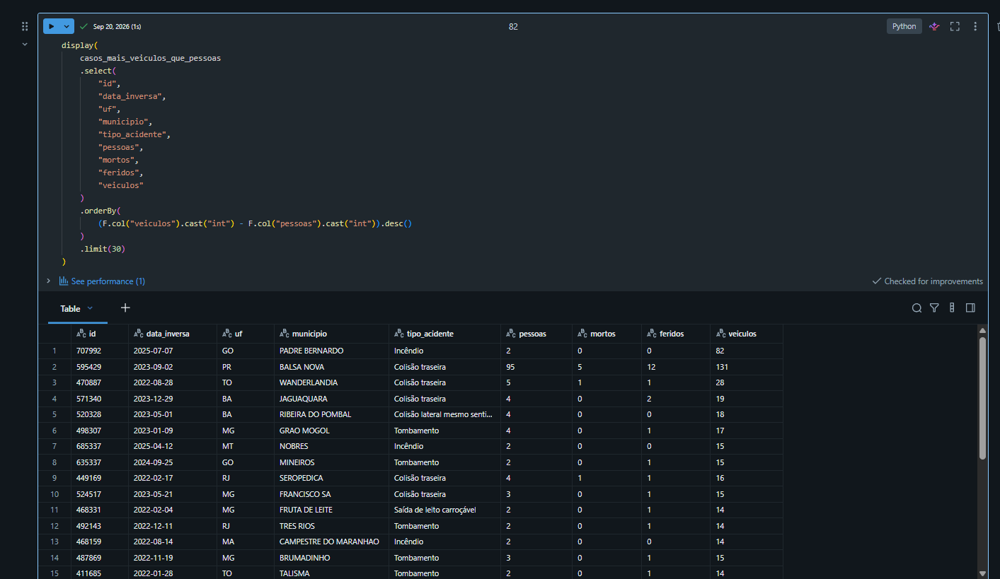

### Decisão no pipeline

Esses registros não foram excluídos automaticamente.

A exclusão completa da ocorrência também eliminaria outras informações potencialmente válidas, como data, localização, tipo do acidente, número de mortos e número de feridos.

Além disso, apenas com os dados disponíveis não era possível determinar com segurança qual campo estava incorreto nem qual seria o valor correto.

Por esse motivo, os registros foram mantidos e a inconsistência foi documentada, evitando a aplicação de correções sem evidência.

A análise de valores extremos foi utilizada como instrumento de avaliação da qualidade dos dados, e não como regra automática de exclusão.

---

# 5. Camada Silver

A tabela tratada foi persistida como:

```text
workspace.default.prf_acidentes_silver
```

A Silver manteve os **342.624 registros** da Bronze.

Foram realizadas:

- conversões de tipos;
- padronização de categorias;
- tratamento de marcadores de ausência;
- criação de atributos derivados;
- estruturação do campo multivalorado de traçado.

Principais atributos derivados:

| Campo | Descrição |
|---|---|
| `ano` | Ano da ocorrência |
| `mes` | Mês da ocorrência |
| `hora` | Hora extraída do horário |
| `fim_de_semana` | 1 para sábado/domingo, 0 para os demais |
| `acidente_fatal` | 1 quando `mortos > 0`, 0 caso contrário |
| `tracado_via_lista` | Lista de características do traçado |

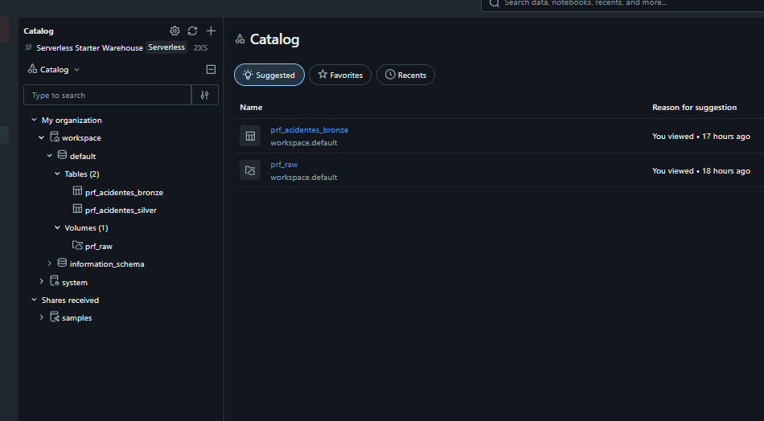

A implementação completa está em:

[`03_transformacao_silver.ipynb`](notebooks/03_transformacao_silver.ipynb)

---

# 6. Modelagem e Catálogo de Dados

A camada Gold foi estruturada utilizando modelagem dimensional.

A granularidade definida para a tabela fato foi:

> **1 linha = 1 ocorrência de acidente.**

## 6.1 Organização das tabelas

| Tabela | Papel | Granularidade / conteúdo |
|---|---|---|
| `fato_acidentes` | Tabela fato | 1 linha por ocorrência |
| `dim_data` | Dimensão temporal | Data, ano, mês, dia da semana, hora e fase do dia |
| `dim_localizacao` | Dimensão geográfica | UF, município, coordenadas e unidades administrativas |
| `dim_via` | Dimensão rodoviária | BR, km, sentido, tipo de pista e uso do solo |
| `dim_acidente` | Dimensão descritiva | Causa, tipo e classificação do acidente |
| `dim_condicoes` | Dimensão ambiental | Condição meteorológica |
| `dim_tracado` | Dimensão de traçado | 1 característica individual de traçado |
| `ponte_acidente_tracado` | Tabela ponte | Relação acidente × característica de traçado |

## 6.2 Modelo da camada Gold

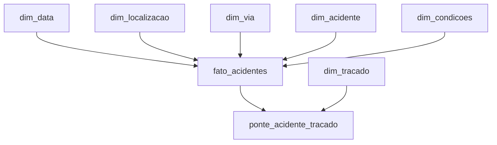

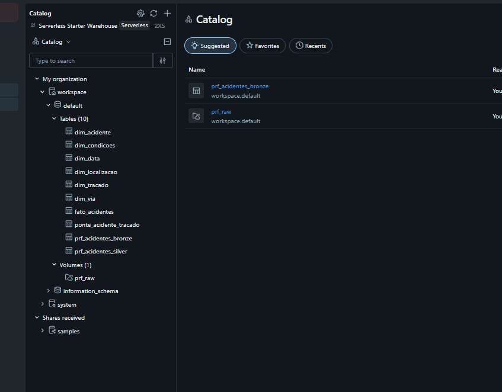

A modelagem completa está em:

[`04_modelagem_gold.ipynb`](notebooks/04_modelagem_gold.ipynb)

## 6.3 Catálogo de Dados

O Unity Catalog foi utilizado para documentar as estruturas criadas, incluindo descrição de tabelas e comentários de colunas.

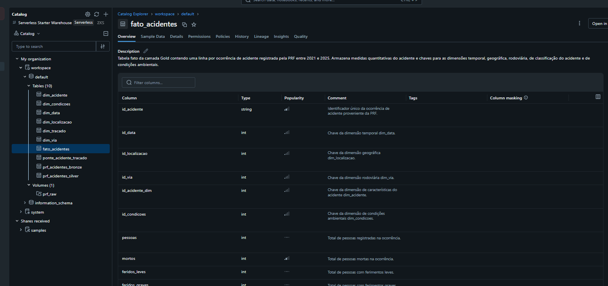

Exemplo do catálogo resumido da tabela fato:

| Campo | Tipo | Descrição | Domínio / Regra | Linhagem |
|---|---|---|---|---|
| `id_acidente` | string | Identificador único da ocorrência | Único | PRF → Bronze → Silver |
| `id_data` | int | Chave da dimensão temporal | FK `dim_data` | Gold |
| `id_localizacao` | int | Chave da dimensão geográfica | FK `dim_localizacao` | Gold |
| `id_via` | int | Chave da dimensão rodoviária | FK `dim_via` | Gold |
| `id_acidente_dim` | int | Chave da dimensão de acidente | FK `dim_acidente` | Gold |
| `id_condicoes` | int | Chave da dimensão ambiental | FK `dim_condicoes` | Gold |
| `mortos` | int | Total de mortos | >= 0 | PRF → Silver |
| `feridos` | int | Total de feridos | >= 0 | PRF → Silver |
| `acidente_fatal` | int | Indicador de fatalidade | 0 ou 1 | Derivado de `mortos` |

---

# 7. Análise das Perguntas de Negócio

A implementação completa das consultas e resultados está no notebook:

[`05_analise_dados.ipynb`](notebooks/05_analise_dados.ipynb)

## 7.1 Pergunta 1 — Evolução dos acidentes

**Pergunta:** Como o número de acidentes, feridos e mortos evoluiu entre 2021 e 2025?

| Ano | Acidentes | Feridos | Mortos |
|---|---:|---:|---:|
| 2021 | 64.567 | 71.873 | 5.397 |
| 2022 | 64.606 | 73.065 | 5.441 |
| 2023 | 67.766 | 78.463 | 5.627 |
| 2024 | 73.156 | 84.526 | 6.160 |
| 2025 | 72.529 | 83.550 | 6.043 |

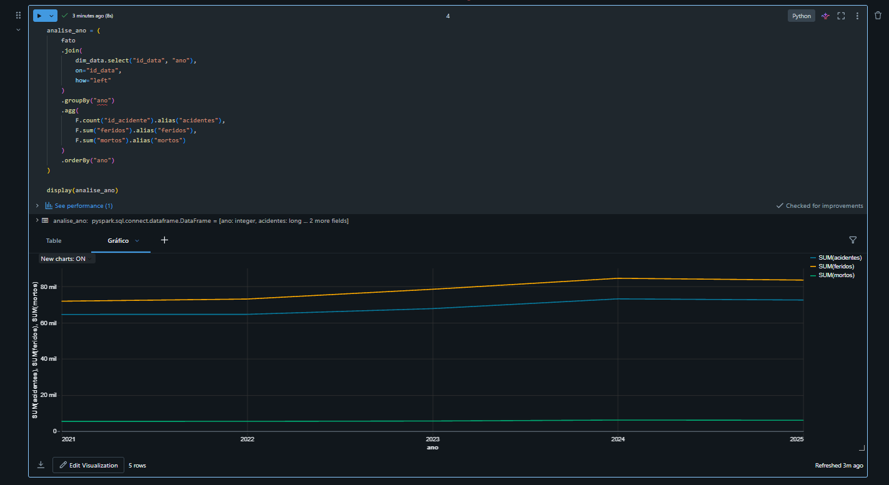

### Interpretação

Entre 2021 e 2024 houve crescimento nos três indicadores.

Em 2025 ocorreu pequena redução em relação a 2024.

Comparando 2021 com 2025:

- acidentes: aproximadamente **+12,3%**;
- feridos: aproximadamente **+16,2%**;
- mortos: aproximadamente **+12,0%**.

O maior nível dos três indicadores ocorreu em 2024.

A análise é descritiva e não permite determinar, isoladamente, as causas das variações observadas.

---

## 7.2 Pergunta 2 — Distribuição geográfica

**Pergunta:** Quais estados, municípios e rodovias concentram mais acidentes e vítimas fatais?

Minas Gerais apresentou os maiores valores absolutos entre as UFs:

- **44.502 acidentes**;
- **3.679 mortes**.

A Bahia apresentou menor volume de acidentes que alguns estados, mas ganhou relevância no ranking por mortes.

O mesmo comportamento ocorreu entre municípios e rodovias.

A BR-101 apresentou o maior número de acidentes, enquanto a BR-116 apresentou o maior número de mortes.

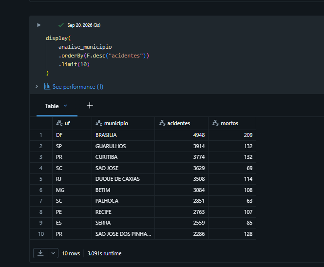

### Interpretação

Os rankings de acidentes e mortes não são equivalentes.

Um local pode concentrar grande quantidade de ocorrências sem necessariamente apresentar a mesma posição no ranking de fatalidades.

Como a análise utiliza valores absolutos, os resultados não devem ser interpretados diretamente como medida de risco, pois não foram normalizados por extensão da rodovia, fluxo de veículos ou volume de viagens.

---

## 7.3 Pergunta 3 — Gravidade por período

**Pergunta:** Como a gravidade dos acidentes varia de acordo com o dia da semana, horário e fase do dia?

Domingo apresentou a maior proporção de acidentes fatais entre os dias da semana, com **8,65%**, seguido pelo sábado, com **8,09%**.

Por horário, a maior proporção ocorreu às **3h**, com **12,66%**.

Por fase do dia:

| Fase do dia | Acidentes | Mortos | Acidentes fatais | % acidentes fatais |
|---|---:|---:|---:|---:|
| Amanhecer | 16.601 | 2.109 | 1.780 | **10,72%** |
| Plena Noite | 119.581 | 13.747 | 12.006 | **10,04%** |
| Anoitecer | 18.821 | 1.444 | 1.267 | 6,73% |
| Pleno dia | 187.621 | 11.368 | 9.566 | 5,10% |

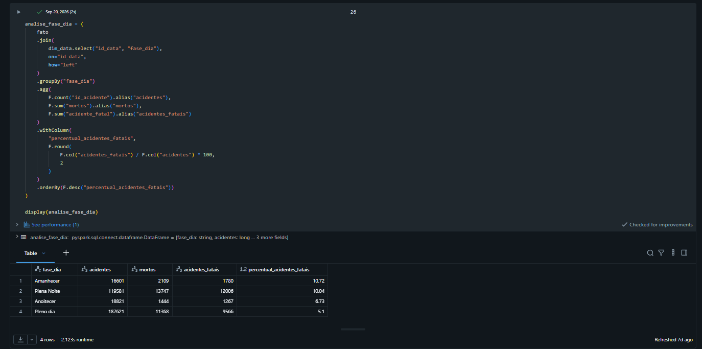

### Interpretação

Os períodos com maior quantidade de acidentes não são necessariamente aqueles com maior gravidade relativa.

O pleno dia concentrou o maior volume de acidentes, mas apresentou a menor proporção de acidentes fatais entre as fases do dia.

A madrugada, o amanhecer e a plena noite apresentaram percentuais mais elevados.

---

## 7.4 Pergunta 4 — Condições meteorológicas e características da via

**Pergunta:** Como condições meteorológicas, tipo de pista e características do traçado da via estão associadas à gravidade dos acidentes?

Entre as condições meteorológicas com volume relevante, `Nevoeiro/Neblina` apresentou a maior proporção de acidentes fatais, com **11,70%**.

Por tipo de pista:

- Simples: **9,84%**
- Dupla: **4,77%**
- Múltipla: **4,13%**

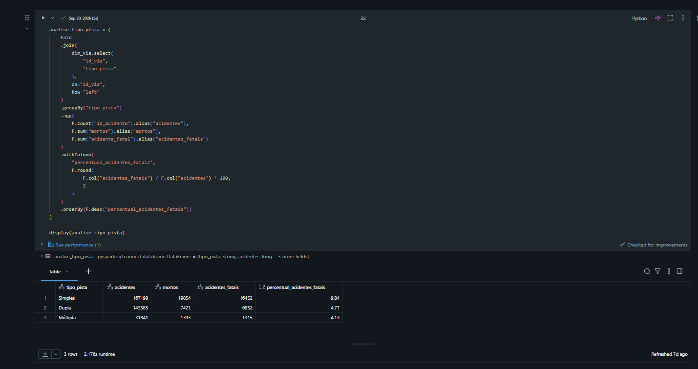

Entre as características de traçado, as maiores proporções foram observadas em:

- Ponte: **10,28%**
- Declive: **9,81%**
- Aclive: **8,89%**
- Curva: **8,12%**

### Interpretação

Pistas simples apresentaram proporção de acidentes fatais aproximadamente duas vezes superior às pistas duplas e múltiplas.

Também foram observadas diferenças entre características de traçado e condições meteorológicas.

Esses resultados representam associações descritivas e não permitem afirmar causalidade.

---

## 7.5 Pergunta 5 — Causas e tipos de acidente

**Pergunta:** Quais causas e tipos de acidente apresentam maior proporção de ocorrências com vítimas fatais?

Entre as causas com maiores proporções de fatalidade destacaram-se:

- `Suicídio (presumido)`: **50,91%**
- `Pedestre andava na pista`: **42,12%**
- `Entrada inopinada do pedestre`: **29,89%**
- `Transitar na contramão`: **29,12%**
- `Pedestre cruzava a pista fora da faixa`: **25,74%**
- `Ultrapassagem Indevida`: **16,78%**

Entre os tipos de acidente:

- `Colisão frontal`: **29,29%**
- `Atropelamento de Pedestre`: **29,04%**
- `Colisão lateral sentido oposto`: **8,60%**

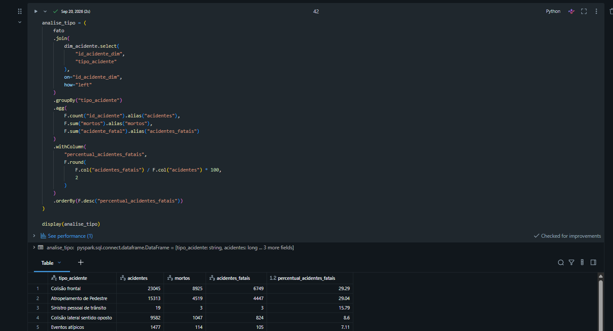

### Interpretação

Frequência e gravidade não são equivalentes.

Algumas categorias possuem grande quantidade de ocorrências, mas menor proporção de acidentes fatais.

Colisões frontais e atropelamentos de pedestres apresentaram, com ampla diferença, as maiores proporções de fatalidade entre os tipos de acidente.

---

# 8. Conclusão Geral

A análise dos acidentes registrados pela PRF entre 2021 e 2025 permitiu identificar padrões temporais, geográficos, ambientais e rodoviários associados à ocorrência e à gravidade dos acidentes.

Os principais resultados foram:

- crescimento de acidentes, feridos e mortos entre 2021 e 2024, seguido por pequena redução em 2025;
- diferenças entre os locais que concentram mais acidentes e aqueles que concentram mais mortes;
- maior proporção de acidentes fatais nos fins de semana, na madrugada, no amanhecer e durante a plena noite;
- maior proporção de acidentes fatais em pistas simples;
- diferenças relevantes entre características de traçado;
- maior gravidade relativa em colisões frontais e atropelamentos de pedestres.

Os resultados reforçam que a quantidade de ocorrências não deve ser utilizada isoladamente para avaliar gravidade.

O estudo é descritivo e identifica associações presentes nos dados, mas não permite estabelecer relações causais.

O projeto demonstra como um pipeline de Engenharia de Dados bem estruturado pode transformar dados brutos em uma estrutura organizada, rastreável e adequada para consumo analítico.

---

# 9. Autoavaliação

O objetivo principal do trabalho foi atingido: foi possível construir um pipeline completo de Engenharia de Dados no Databricks e utilizar a estrutura criada para responder às cinco perguntas de negócio definidas no início do projeto.

Ao longo do desenvolvimento, um dos principais aprendizados foi perceber que a qualidade de dados não se resume à identificação de valores nulos. A análise semântica foi importante para detectar valores como `IGNORADO`, `N/A` e `NÃO INFORMADO`, que tecnicamente eram strings válidas, mas representavam ausência de informação.

Outro aprendizado importante foi a necessidade de investigar os dados antes de realizar correções. O caso de `Colisão lateral` mostrou que uma aparente inconsistência poderia estar relacionada a uma mudança de classificação da fonte. Por isso, os registros foram preservados em vez de serem alterados sem evidência.

A modelagem do campo `tracado_via` também exigiu uma decisão específica, pois uma ocorrência pode possuir várias características de traçado. A utilização de uma dimensão e uma tabela ponte permitiu preservar essa informação sem alterar a granularidade da tabela fato.

Também houve dificuldade na criação dos relacionamentos da tabela fato com dimensões contendo valores nulos. O problema foi tratado utilizando comparações compatíveis com valores nulos durante os joins.

Como limitações, o trabalho utiliza dados observacionais e não incorpora variáveis externas de exposição, como fluxo de veículos, extensão das rodovias e volume de viagens. Dessa forma, os rankings absolutos não devem ser interpretados como medidas diretas de risco.

Como evolução futura, o pipeline poderia incluir:

- ingestão automatizada e incremental;
- testes automáticos de qualidade;
- dados de fluxo de veículos;
- extensão das rodovias;
- informações meteorológicas externas;
- dashboards;
- métricas de risco normalizadas por exposição.

De forma geral, o MVP permitiu aplicar na prática conceitos de ingestão, tratamento, qualidade, modelagem, linhagem e análise de dados.

---

# 10. Tecnologias Utilizadas

- Python
- PySpark
- Apache Spark
- Spark SQL
- Databricks Free Edition
- Delta Lake
- Unity Catalog
- Git
- GitHub
- Markdown

---
